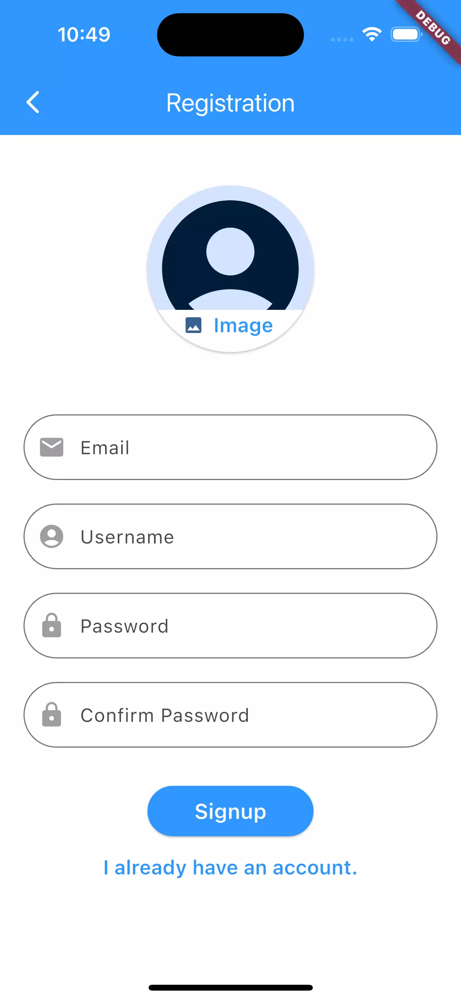
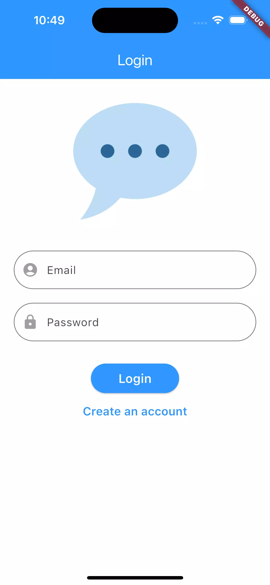
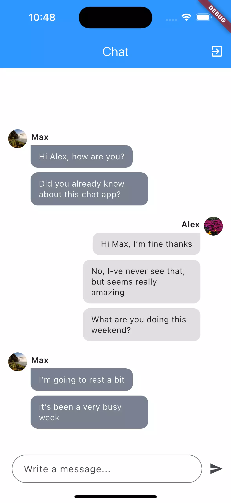

# Chat App (Flutter)

## About
Multi-platform chat application built with **Flutter**. This Mobile App utilizes a wide range of features, including **Creation Account**, **Login**, **Firebase**, **Firestore**, and more.

Here you can create your account and chat with other people inside the app.

  

## Note
This is just an exercise and not a real publishable app.